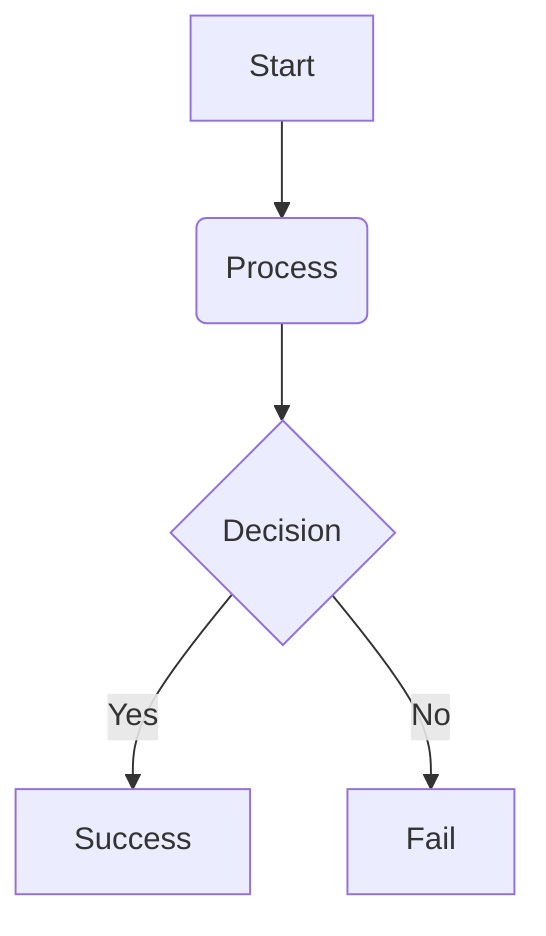

# Capstone Project: AI Support Resolution Agent

> **Author:** Paul Jebasingh  
> **Repository:** `https://github.com/<username>/ai-support-resolution-agent`  
> **Status:** In Progress (Phase 1 Completed)  
> **Target Environment:** VS Code | Python 3.11+ | Cloud / Local Runtime  
> **Documentation Version:** 1.0.0  

---

## 📌 Table of Contents
1. [Project Overview & Objectives](#project-overview--objectives)
2. [High-Level Architecture & Tech Stack](#high-level-architecture--tech-stack)
3. [Project Directory & Evidence Structure](#project-directory--evidence-structure)
4. [Phase-by-Phase Roadmap](#phase-by-phase-roadmap)
   - [Phase 1: Problem Framing, Success Criteria & Requirements](#phase-1-problem-framing-success-criteria--requirements)
   - [Phase 2: Architecture Design, Tool Contracts & Data Layer](#phase-2-architecture-design-tool-contracts--data-layer)
   - [Phase 3: Agent Core Logic, RAG & Safety Guardrails](#phase-3-agent-core-logic-rag--safety-guardrails)
   - [Phase 4: Client Interface & Human-in-the-Loop Orchestration](#phase-4-client-interface--human-in-the-loop-orchestration)
   - [Phase 5: Automated Testing, Red Teaming & Performance Evaluation](#phase-5-automated-testing-red-teaming--performance-evaluation)
   - [Phase 6: Final Deployment, Packaging & Project Sign-Off](#phase-6-final-deployment-packaging--project-sign-off)
5. [Git Workflow & Commit Conventions](#git-workflow--commit-conventions)
6. [VS Code Execution & Evidence Capture Guidelines](#vs-code-execution--evidence-capture-guidelines)
7. [Appendix: Troubleshooting & Operational Notes](#appendix-troubleshooting--operational-notes)

---

## 1. Project Overview & Objectives

### 1.1 Executive Summary
The **AI Support Resolution Agent** is an enterprise-grade customer support assistant designed to handle multi-step user inquiries, ground responses strictly in company policy documentation, safely invoke backend APIs, mask sensitive PII prior to logging, and escalate complex or high-risk cases to human agents.

### 1.2 Key Objectives
- [x] **Objective 1:** Define comprehensive problem framing, user personas, strict safety boundaries, and quantitative evaluation criteria.
- [ ] **Objective 2:** Implement deterministic backend tool schemas, mock APIs, and a vectorized policy retrieval index.
- [ ] **Objective 3:** Build a ReAct-based agentic workflow integrated with PII sanitization and input/output guardrails.
- [ ] **Objective 4:** Establish an automated evaluation suite measuring faithfulness, tool accuracy, refusal precision, and latency.

---

## 2. High-Level Architecture & Tech Stack

### 2.1 Technology Matrix
| Component / Layer | Technology / Framework | Purpose |
| :--- | :--- | :--- |
| **Language & Runtime** | Python 3.11+ | Core runtime environment |
| **Orchestration / Framework** | LangChain / LangGraph | Multi-step agent graph & ReAct reasoning loop |
| **Vector DB / Knowledge Base** | ChromaDB / FAISS | Ground truth policy retrieval index (RAG) |
| **Safety & Redaction** | Microsoft Presidio / Regex | Ingress/egress PII masking and audit log sanitization |
| **Backend / API Mock** | FastAPI | Deterministic order, refund, and ticket mock endpoints |
| **UI / Client Layer** | Streamlit | Support representative & customer chat workspace |
| **Testing & Evaluation** | Pytest, Ragas | Unit testing, red teaming, and LLM-as-a-judge metrics |

---

### 2.2 System Architecture Diagram

    
+-----------------------------------------------------------------------------------+
|                                Client / UI (Streamlit)                            |
+-----------------------------------------------------------------------------------+
                                          |
                                          v
+-----------------------------------------------------------------------------------+
|                         Ingress Safety & PII Sanitizer                            |
|             (Masks SSN, CC, Phone, Email before Context Loading & Logging)        |
+-----------------------------------------------------------------------------------+
                                          |
                                          v
+-----------------------------------------------------------------------------------+
|                           Agent Orchestrator (LangGraph)                          |
|  +--------------------+     +-----------------------+     +--------------------+  |
|  | Policy RAG Index   | <-> |   ReAct Reasoning     | <-> | Tool Invocation    |  |
|  | (ChromaDB Vector)  |     |   Engine (LLM)        |     | (Order/Refund/CRM) |  |
|  +--------------------+     +-----------------------+     +--------------------+  |
+-----------------------------------------------------------------------------------+
                                          |
                        +-----------------+-----------------+
                        | (Standard)                        | (Escalation / Risky)
                        v                                   v
+------------------------------------+    +-----------------------------------------+
| Grounded Customer Response         |    | Human-in-the-Loop (HITL) Handoff Ticket |
+------------------------------------+    +-----------------------------------------+
                                          |
                                          v
+-----------------------------------------------------------------------------------+
|                          Egress Sanitizer & Masked Audit Log                      |